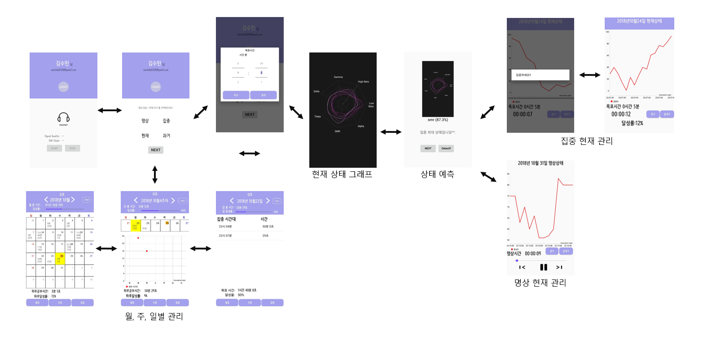

# Graduation Project
### **Hongik University graduation project.**
An application that manages meditation and concentration using EEG data.

### 1. Development Tools
**1.1 Hardware**
* Neurosky Mindwave Mobile

**1.2 Software**
* OS: Window10
* Language: JAVA, Python
* Tool: Android Studio, Processing3, TensorFlow, Colaboratory
* DB: Firebase

### 2. ScreenShot

